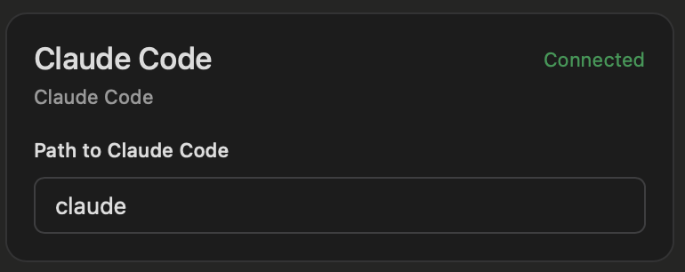
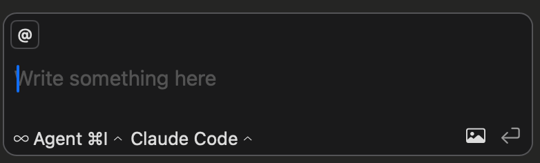

# **cmd**: agentic AI in Xcode

`cmd` is an agentic AI assistant for the work you do in Xcode. It helps you plan, handles routine tasks and answers your questions so that you can focus on the most **valuable** and **creative** parts of your work.

## AI, in Xcode

`cmd` integrates in your existing workflows with Xcode. No need for another IDE. `⌘`+`I` brings the assistant, `⌘`+`␛` backgrounds it.

## Delegate your work
`cmd` autonomously handles various tasks. From new code generation, to bug fixing, to refactoring, to understanding new codebases, it can help you in many aspects of your job.

## You're in control
- Use any LLM provider of your choosing (if your preferred provider is not yet supported, open an issue and we'll add support)
- Your data is shared with no 3rd party other than the LLM provider you chose. All processing is local
- `cmd` is free to use. No murky pricing or misaligned incentives. You bring your own API keys and get the most out of them
- fine grained permissions about what agents can do autonomously
- `cmd` is open source with an Apache 2.0 license

## Installation
- Download [the latest release](https://github.com/getcmd-dev/cmd/releases)
- Extract the app, move it to `Applications`
- Open the app, and follow the quick setup (Accessibility permission, Bring your own API key)
- If using Xcode 26 follow the additional steps.
- Enjoy!

## Claude Code
You can easily use Claude Code in `cmd`. In the LLM providers settings, enter what you use to launch Claude Code (typically just `claude`). `Claude Code` then becomes available in the LLM options. Using it will delegate all the agentic AI to Claude Code, and you can enjoy a great integration with Xcode.

    
    &nbsp; &nbsp; &nbsp; &nbsp;
    

## Xcode 26
`cmd` integrates with Xcode 26, bringing powerful agentic AI and making integration with LLM providers easier. When using Xcode 26, you can interact with `cmd` using either Xcode's built AI chat, or `cmd`'s own interface that provides a richer UI.

#### Additional Installation steps for Xcode 26's AI chat
- Go to Xcode > Settings > Intelligence > Add a Model Provider
- Select a local model, running on port 10101

- Interact with `cmd` using either Xcode 26 built in AI chat, or `cmd`'s richer UI.

## Roadmap & contributions
[We welcome contributions](./contributing.md)! Help us make your work more enjoyable.

Sharing feedback or opening a well documented issue is also greatly helpful.

`cmd` works well already, and there's a lot we want to do in the short term:
- MCP integration
- Web search
- Visibility in API cost
- Task / sub-task orchestration
- Increase LLM provider support
- Integration with UI previews
- tools refinement
- Misc UI & UX improvements

and much more! `cmd` is early stage, and in active development.

## Acknowledgement
- [CopilotForXcode](https://github.com/intitni/CopilotForXcode) that has been very influential for the Xcode integration
- [Sentry](http://sentry.io/) and [Github](https://github.com) for their generous support of OSS.
