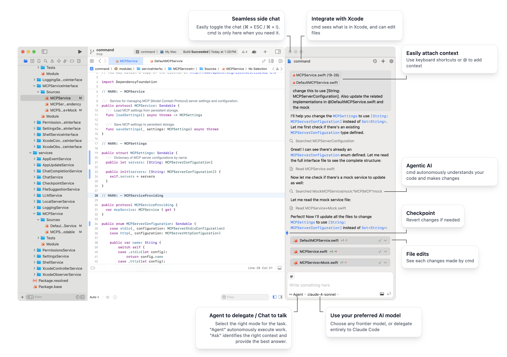

# **⌘ cmd**

The best AI in Xcode, open source.

- 🤝 Integrates in Xcode
- ✨ Generate code from natural language
- 🤖 Checks its own work
- 🌐 Open source, open choice of models
- 👉 Works with Claude Code
- 👉 Works with Xcode 26's AI chat
- 🪪 [Official getcmd.dev home page](https://getcmd.dev/)

## Key features:
- **Seamless integration in Xcode**: `cmd` operates as a side panel in Xcode. It sees what is in Xcode, can edit files and take other actions.
- **Best agentic AI in Xcode**: `cmd` uses frontier models and provides them with file access, build tools, and project context for effective code generation.
- **Easy to trust**: `cmd` is open source and runs entirely locally. No data about your code is sent to 3rd parties other than the AI providers of your choosing. You can opt out of anonymised analytics.
- **Claude Code**: `cmd` brings Claude Code to Xcode, as the first external agent supported.
- **Chose the AI provider you want**: `cmd` supports the most popular AI providers. If you need another one, reach out!

## Installation

<ul>
    <li><code>brew install cmd</code> (or alternatievly <a href="https://github.com/getcmd-dev/cmd/releases/download/v0.1.25/cmd.dmg">download the latest release</a>)</li><!-- version automatically updated during release -->
    <li>Open the app, and follow the quick setup (Accessibility permission, Bring your own API key)</li>
    <li>
        

            
Xcode 26 integration

            <ul>
                <li>Go to <code>Xcode > Settings > Intelligence > Add a Model Provider</code></li>
                <li>
                    Select a local model, running on port 10101 
                    
                </li>
                <li>
                    Interact with <code>cmd</code> using either Xcode 26 built in AI chat, or <code>cmd</code>'s own UI. 
                    
                </li>
            </ul>
        

    </li>
</ul>

## High level technical overview

- `cmd` uses the accessibility permission to "see" what is in Xcode, including which project/file is open, which code is selected etc.
- `cmd` is mostly a Swift/SwiftUI application. It bundles a shallow layer of javascript that eases the interaction with external APIs.
- The Swift application has two targets (the main app and an app extension for Xcode extension) that are each mostly one Swift Package with many targets. The code is structured across many modules, that are each bundled in their of SPM target.

## Demos

### Agent mode

[agent-mode.webm](https://github.com/user-attachments/assets/36305127-5946-4fb2-bd28-0e2d8248a46f)

Delegate entire tasks to an autonomous agent. Remain in the loop with instant feedback, and in control thanks to fine grained permissions.

### Chat mode
[chat-mode.webm](https://github.com/user-attachments/assets/4d8b9087-f81d-4115-bb77-67ab27efe6d3)

Switch to 'Chat' mode and get detailed answers or explanations without modifying your code. Compared to other chat alternatives (e.g. ChatGPT, Google etc), cmd provides relevant context to get more accurate results.

### Claude Code

[claude-code.webm](https://github.com/user-attachments/assets/6b41fd4a-b8ba-4e7d-beea-92e0ffcbf39a)

You can interact directly with Claude Code through cmd. If you prefer using Claude Code over other tools for its advanced agentic capabilities, or because you have a subscription cmd has you covered. cmd makes Claude Code accessible right from Xcode, and displays its output in a rich native UI.

### Xcode 26

[xcode26-demo.webm](https://github.com/user-attachments/assets/42860f8e-d167-424b-b144-4651bd179d29)

In Xcode 26, you can chose to interact with cmd through the new 'Code Assist' interface. When working on complex tasks, cmd's agentic AI is much more powerful than that of Xcode which cripples the most powerful LLMs with unnecessary privacy limitations. It's also easier to manage configurations like using a specific AI provider in cmd.

## Contributing & Roadmap
[We welcome contributions](./contributing.md)! Help us make your work more enjoyable.

Sharing feedback or opening a well documented issue is also greatly helpful.

`cmd` works well already, and there's a lot we want to do in the short term:
- MCP integration
- Web search
- Visibility in API cost
- Task / sub-task orchestration
- Increase LLM provider support
- Integration with UI previews
- tools refinement
- Misc UI & UX improvements

and much more! `cmd` is early stage, and in active development.

## Acknowledgement
- [CopilotForXcode](https://github.com/intitni/CopilotForXcode) that has been very influential for the Xcode integration
- [Sentry](http://sentry.io/) and [Github](https://github.com) for their generous support of OSS.
