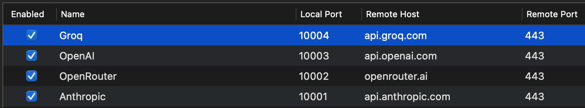

# Setup

```
# helper for dev tools to bashrc
echo '
# Run helper tools for the cmd app
function cmd {
  "$(git rev-parse --show-toplevel)/cmd.sh" "$@"
}' >> ~/.zshrc
source ~/.zshrc

# install brew
/bin/bash -c "$(curl -fsSL https://raw.githubusercontent.com/Homebrew/install/HEAD/install.sh)"

brew install nvm
# complete nvm installation as per instructions

(cd ./local-server && nvm use)
cmd install:swiftformat

brew install jc
brew install jq
brew install shfmt
brew install yarn

cp -R ./tools/githooks/. .git/hooks

# Ruby version management
brew install chruby ruby-install
ruby-install ruby
echo '
# Ruby
source /opt/homebrew/opt/chruby/share/chruby/chruby.sh
source /opt/homebrew/opt/chruby/share/chruby/auto.sh' >>  ~/.zshrc
source ~/.zshrc
gem install bundler && bundle install
```

## Architecture overview
command has a macOS app and a local node server:
- the macOS app handles all the UI/UX and intergration with Xcode.
- the local node server handles some business logic that leverages open source code written in typescript. Some examples include interfacing with external providers, defining some agentic tools etc. It's not worth re-building the wheel in Swift for the sake of it. The installation of node and the local server is managed by the macOS app.

## App developement
See the [app's development guide](./app/contributing.md) for more details.

## Proxying network traffic
`cmd` sends requests from both the macOS app and the node process it launches. Requests from the macOS app can be proxied in a standard way by any proxy tool. Requests from the node process (which include all chat completion) require some specific setup:
- Set env variables for the provider you want to proxy. For instance:
```bash
# in ~/.zshrc
export ANTHROPIC_LOCAL_SERVER_PROXY="http://localhost:10001/v1"
export OPEN_ROUTER_LOCAL_SERVER_PROXY="http://localhost:10002/api/v1"
export OPENAI_LOCAL_SERVER_PROXY="http://localhost:10003/v1"
export GROQ_LOCAL_SERVER_PROXY="http://localhost:10004/openai/v1"
```
- Set a reverse proxy in your proxy tool. For instance in Proxyman (Tools > Reverse Proxy...):

